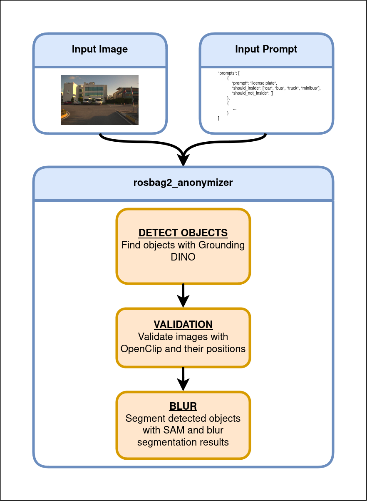
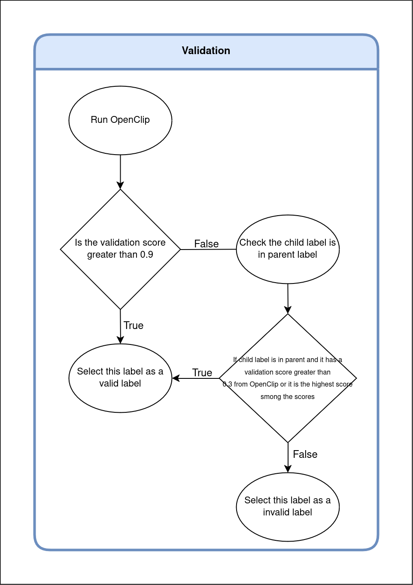

### Introduction

A tool to anonymize images in ros2 bags. 

<p align="center">
  
</p>

<p align="center">
  
</p>

### Installation

**Clone the repository**

``` shell
git clone git@github.com:leo-drive/rosbag2_anonymizer.git
cd rosbag2_anonymizer
```

**Download the pretrained weights**

``` shell
wget https://dl.fbaipublicfiles.com/segment_anything/sam_vit_h_4b8939.pth

wget https://huggingface.co/ShilongLiu/GroundingDINO/resolve/main/GroundingDINO_SwinB.cfg.py
wget https://huggingface.co/ShilongLiu/GroundingDINO/resolve/main/groundingdino_swinb_cogcoor.pth
```

**Install ros2 mcap dependencies if you will use mcap files**

``` shell
sudo apt install ros-humble-rosbag2-storage-mcap
```

**Install pip packages**


``` shell
pip install -r requirements.txt
```

### Usage

**Check `config.yaml` and run `main.py`**

``` shell
python3 main.py
```
